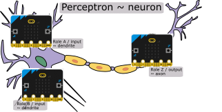
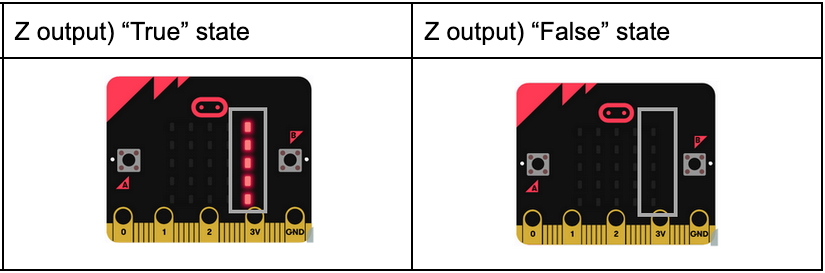
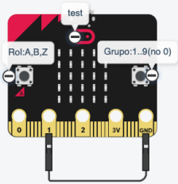
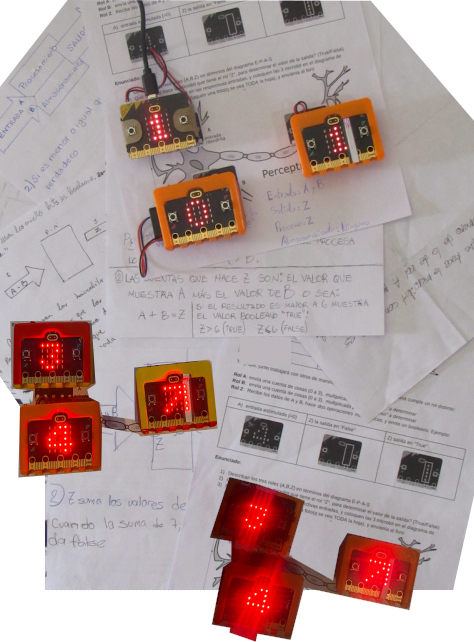

# README.md - Sistema de Votación ClassQuiz con Micro:bit

## Descripción del Proyecto

Sistema de votación distribuida para educación que integra dispositivos **BBC micro:bit** con la plataforma web **ClassQuiz**. Permite a estudiantes participar en quizzes interactivos usando hardware físico en lugar de navegadores web.

---

## Arquitectura del Sistema

```
┌─────────────┐     Radio      ┌──────────────┐
│ Micro:bit   │ ◄────────────► │ Micro:bit    │
│ Estudiante  │     2.4GHz     │ Concentrador │
└─────────────┘                └──────┬───────┘
                                      │ USB-UART
                                      ▼
                               ┌──────────────┐
                               │ Proxy Python │
                               │ (PC/Netbook) │
                               └──────┬───────┘
                                      │ Socket.IO
                                      ▼
                               ┌──────────────┐
                               │  ClassQuiz   │
                               │   Backend    │
                               └──────────────┘
```

### Componentes

**1. Estudiante (estudiante.py)**
- Ejecuta en micro:bit de cada alumno
- Navegación de opciones con botones A/B
- Confirmación de voto con A+B simultáneo
- Display muestra opción actual (A/B/C/D)
- Comunicación por radio con concentrador

**2. Concentrador (concentrador.py)**
- Ejecuta en micro:bit USB conectado a PC
- Coordina hasta 30+ dispositivos estudiante
- Protocolo discovery para registro automático
- Polling secuencial para evitar colisiones
- Bridge USB-UART ↔ Radio

**3. Proxy (proxy.py)**
- Ejecuta en PC/netbook del docente
- Cliente Socket.IO multi-instancia
- Mapeo device_id → username ClassQuiz
- Traducción de protocolos micro:bit ↔ ClassQuiz

---

## Protocolo de Comunicación

### Radio (Micro:bit ↔ Micro:bit)

**Formato CSV:** `COMANDO:parametro1:parametro2`

| Comando | Dirección | Payload | Propósito |
|---------|-----------|---------|-----------|
| `REPORT` | Conc → Est | - | Solicitar registro |
| `ACK:device_id` | Est → Conc | device_id | Respuesta registro |
| `QPARAMS:tipo:num` | Conc → Est | tipo, opciones | Configurar pregunta |
| `POLL:device_id` | Conc → Est | device_id | Solicitar voto |
| `ANSWER:id:opcion` | Est → Conc | device_id, voto | Enviar respuesta |

### USB-UART (Micro:bit ↔ PC)

**Formato JSON** (tolerante a espacios):

```json
{
  "type": "question_params",
  "q_type": "unica",
  "num_options": 4
}
```

```json
{
  "type": "answer",
  "device_id": "1d4a339694f35219",
  "answer": "C"
}
```

### Socket.IO (Proxy ↔ ClassQuiz)

Eventos estándar ClassQuiz:
- `join_game` - Registro con username único
- `set_question_number` - Recepción de pregunta
- `submit_answer` - Envío de respuesta
- `question_results` - Feedback de resultado

---

## Flujo de Votación

```
1. DOCENTE inicia quiz en ClassQuiz web
   ↓
2. PROXY recibe evento "set_question_number"
   ↓
3. PROXY envía por USB: question_params
   ↓
4. CONCENTRADOR broadcast radio: QPARAMS:unica:4
   ↓
5. ESTUDIANTE resetea voto, habilita botones A/B
   ↓
6. ALUMNO navega opciones (A→B→C→D) y confirma (A+B)
   ↓
7. PROXY envía por USB: start_poll
   ↓
8. CONCENTRADOR hace polling: POLL:device_id_1, POLL:device_id_2...
   ↓
9. ESTUDIANTE responde: ANSWER:1d4a339694f35219:C
   ↓
10. CONCENTRADOR reenvía USB: {"type":"answer"...}
    ↓
11. PROXY mapea device_id → username y envía Socket.IO
    ↓
12. CLASSQUIZ procesa voto y muestra resultado
```

---

## Instalación y Uso

### Requisitos

**Hardware:**
- 1 micro:bit v2 (concentrador)
- N micro:bits v2 (estudiantes, máx ~30)
- Cable USB micro:bit ↔ PC
- PC/Netbook con Python 3.8+

**Software:**
- Python 3.8+
- Librerías: `pyserial`, `python-socketio[client]`, `requests`
- Editor Mu o MakeCode para flashear micro:bits

### Instalación

1. **Instalar dependencias Python:**
```bash
pip install pyserial python-socketio requests websocket-client
```

2. **Flashear micro:bits:**
   - `estudiante.py` → Todos los micro:bits de alumnos
   - `concentrador.py` → Micro:bit conectado a USB

3. **Configurar proxy:**
```python
# En proxy.py
SERIAL_PORT = "COM3"  # o /dev/ttyACM0 en Linux
GAME_PIN = "123456"
CLASSQUIZ_URL = "https://classquiz.example.com"
```

4. **Ejecutar sistema:**
```bash
python proxy.py
```

### Uso en Clase

1. Docente crea quiz en ClassQuiz web
2. Inicia juego y obtiene PIN
3. Configura PIN en proxy.py
4. Ejecuta `python proxy.py`
5. Proxy registra automáticamente todos los micro:bits
6. Docente inicia pregunta
7. Alumnos votan con botones
8. Resultados se muestran en ClassQuiz

---

## Características Técnicas

### Gestión de Colisiones Radio

Sistema de dos fases para evitar colisiones entre 30+ dispositivos:

**Fase 1: Discovery (aleatorio con ACK)**
- Concentrador broadcast `REPORT` cada 100ms
- Estudiantes responden con delay aleatorio 0-2000ms
- Concentrador envía ACK confirmando registro
- Estudiante solo se registra tras recibir ACK

**Fase 2: Polling (secuencial)**
- Concentrador itera device_ids registrados
- Envía `POLL:device_id` específico
- Solo el estudiante con ese ID responde
- 0% colisiones garantizadas

### Optimizaciones de Memoria

Micro:bit v2 tiene **128KB RAM**, pero MicroPython consume ~100KB:

- Mensajes radio máx 32 bytes (default) o 64 (config)
- CSV en lugar de JSON: `"A,B,C"` vs `{"a":"A","b":"B"}`
- Sin f-strings: usar `.format()` o concatenación
- Device ID hexadecimal: `''.join(['{:02x}'.format(b) for b in machine.unique_id()])`

### Tolerancia a Reseteos

Estudiantes pierden estado al presionar botón reset:
- Device ID se recalcula (machine.unique_id() = hardware ID)
- Responden a siguiente `REPORT` broadcast
- Proxy mantiene mapeo persistente device_id → username

---

## Archivos del Proyecto

```
/
├── estudiante.py          # Firmware micro:bit alumno
├── concentrador.py        # Firmware micro:bit USB
├── proxy.py               # Servicio Python PC
├── README.md              # Este archivo
├── informe_errores_microbit_uart.md  # Debugging guide
└── arquitectura-completa-microbit-classquiz.mermaid
```

---

## Limitaciones Conocidas

- **Máx ~30 dispositivos:** Limitado por RAM y tiempo de polling
- **Radio 2.4GHz:** Interferencia con WiFi en mismo canal
- **Sin encriptación:** Protocolo radio en texto plano
- **MicroPython:** Sin JSON parsing nativo, parser manual requerido
- **Display 5×5:** Solo 4 opciones visualizables (A/B/C/D)

---

## Solución de Problemas

### Estudiante no registra

1. Verificar radio habilitada: `radio.on()`
2. Mismo canal radio: `radio.config(channel=7)`
3. Revisar logs: display muestra "?" hasta ACK

### Concentrador no recibe comandos USB

1. Puerto correcto: `ls /dev/ttyACM*` (Linux) o Device Manager (Windows)
2. Baudrate: 115200 default
3. Revisar parser: buscar keywords, no formato JSON exacto

### Proxy no conecta Socket.IO

1. URL ClassQuiz correcta
2. PIN válido y juego activo
3. Redis funcional en ClassQuiz backend

---

## Créditos y Licencia

**Autor del proyecto:** Leandro Batlle (Colegio Nacional de Buenos Aires)  
**Framework base:** microbitML (Enseñanza ML con micro:bits)  
**Integración ClassQuiz:** Desarrollo contractual CDIA/Fundación Sadosky  

**Licencia:** Por definir

---

## Soporte

Para reportar bugs o solicitar features, contactar al equipo de desarrollo del proyecto microbitML/ClassQuiz.

**Documentación adicional:**
- `informe_errores_microbit_uart.md` - Guía de debugging USB/UART
- `guia_documentacion_microbitml.md` - Estándares de código
- `MICROBIT_INCOMPATIBILIDADES.md` - Limitaciones MicroPython
# microbitML


Framework and proof of concept for Machine Learning practices (perceptrons, MLP and so on) using a swarm of version2 [BBC Micro:bit](https://python.microbit.org/)'s, for high-school formal Education.

Microbits communicate via bluetooth, but are grouped (in app layer) in teams. Within each team, each MB must  assume a different role.  The whole class uses the same channel, in order to accommodate a monitoring/teaching node.


## Proof of concept


In the case of this proof of concept, a Perceptron is formed by a team of three MB. Two acting as inputs/dendrites and one as the output/axon. Not a multi-layer perceptron, all three Microbits compose one perceptron. These are the roles of each one:

- Role A: sends a count of 3 things, multiplied by 1, valid values: {0,1,2,3}.
- Role B: sends a count of (other) 3 things, multiplied by 2, valid values: {0,2,4,6}
- Role Z: Receives the data from A and B, adds them and applies a binary activation function that will be "True" iif the sum exceeds 6.




Count on input nodes are updated by pressing buttons A and B. Here's a detail on Role Z's output:




## Usage:  proof-of-concept 

1. Download the same .hex file to every Microbit in class (teaching node is not implemented yet)
2. Separate the class in groups of three MB's. Maybe groups of six~ten students, sharing 3 MB, is fine.
3. Each group must have all MB's configured accordingly to assigned group and role. To change those, keep pin one  connected to ground, and press buttons A and B. When done, disconnect pin 1, to restore normal button operation.
   1. Button A cycles role. In the p-o-c, available roles are {A,B,Z}
   2. Button B cycles group {0,1,..,9}
            
      
1. At any time,  group and role, can be checked by touching the Micro:bit logo. Avoid group 0, since any node can fallback to that group if eventually restarted.
2. Your class is set
3. You can now conduct any teaching experience you want. For example:
   1. Give the class some context on Microbits A and B being inputs for a perceptron, and vertical bar in Z is the boolean output (giving them a printed sheet with the neuron sketch above to place them, might help). When ready, a task for them would be to figure out the answer to questions like:
	   1. Guess what TWO math operation drives vertical bar in Z? (answer: sums A and B, then compares to 6)
	   2. What's the difference between A and B? ( A multiplies it's count by 1, B multiplies it's count by 2)
   2. After all groups inferred the answer to your questions, just by discussing individual  interaction with their MB, you can discuss with them in Machine Learning jargon:
      1. Microbits A,B and Z form a **perceptron**, the basic processing element in ML
      2. A and B store different **weights**, that constitute a **ML Model**
      3. Z sums and applies an **activation function**. It's output might be a final **classification** of the model. Or, if part of a different **architecture**, the output might  **feed forward**  yet another **layer** of perceptrons in an **MLP**. Z might apply a **bias**, with is also part of the *ML model* . 
      4. *weights* of A and B are fixed here, but the "Learning" part of "Supervised ML" consists of adapting those *weights and bias*, by means of several thousands of cycles of exposure to  **tagged samples**, that form a **dataset**. Each cycle emprobes the model by applying small changes in *weights and bias*. That's called **training**. Training goes on, until some metric is considered satisfactory by the **data scientists** that designed the **ML pipeline**.
      5. As part of the *ML pipeline* the *model* is **validated** against an all-new *dataset*. If that metrics holds the model is considered production-grade. Otherwise, more *training* is needed. The huge  amount the training data needed, is often the main weakness of *ML pipelines* and the resulting *Supervised Machine Learning models*
      6. Conclusion: when consuming ML-equipped devices, ALWAYS beware that errors in classification will happen, specially if the underlying *model* is not *trained* for your particular application.



## Credits

- heavily based on Prof Fujio Yamamoto's blog article on [building a Microbit network emulating a MLP](https://sparse-dense.blogspot.com/2018/06/microbittwo-layer-perceptronxor.html). Thanks a bunch, Mr Yamamoto!!
- (C) 2024 - 2025 [Leandro Batlle](https://www.linkedin.com/in/lean-b/) - Área de Innovación Educativa Científico-Tecnológica - [Colegio Nacional de Bs As](https://www.cnba.uba.ar)
- (C) 2025 - [Fundación Sadosky](https://fundacionsadosky.org.ar/)

