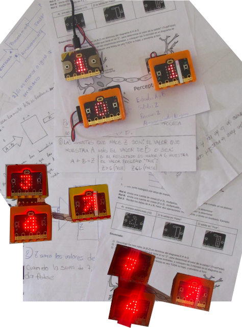

# microbitML

[Framework](https://es.wikipedia.org/wiki/Framework) educativo para actividades grupales con [BBC micro:bit](https://github.com/microbit-foundation/) y [MicroPython](https://python.microbit.org).

Los micro:bits se comunican por radio y se agrupan en equipos. Dentro de cada equipo, cada dispositivo asume un **rol** diferente. Todo el aula comparte el mismo canal de radio, lo que permite también un nodo docente (hub+gateway).

microbitML es completamente compatible con [micro:bit Classroom](https://classroom.microbit.org/), la herramienta oficial de gestión de clase para micro:bits.


El framework fue diseñado para que el docente que crea o aplica una actividad, se concentre en la **Zona de Desarrollo Próximo** (ZDP) de Vygotsky como eje pedagógico: ningún dispositivo puede completar una actividad en soledad —el resultado emerge de la interacción entre pares—, lo que convierte la colaboración en una condición técnica, con implicancias didácticas. El docente, con visibilidad en tiempo real del estado de cada grupo desde la interfaz, puede intervenir selectivamente como *par más capaz* justo donde cada equipo lo necesita. Desde la perspectiva de Erikson, las actividades están calibradas para la transición entre la etapa de *Industria* (consolidar competencia, ~10–12 años) y la de *Identidad* (~12–18 años): cada estudiante asume un rol concreto y diferenciado dentro del grupo, lo que genera sentido de competencia individual y pertenencia colectiva - condiciones que propician el aprendizaje significativo en esas edades.


---

## Requisitos

- **Hardware:** 2 o más BBC micro:bit (V1 o V2)
- **Firmware:** editor web [python.microbit.org](https://python.microbit.org) (para cargar o editar el código `.py`); o archivos `.hex` precompilados para carga directa sin instalar nada
- **Aplicación de escritorio** (solo para mbClassquiz): Python 3.x — ver dependencias en `mbClassquiz/Interface_grafica/requirements.txt`

---

## Actividades

Las actividades incluidas en este repositorio son **demostraciones de referencia**. Su propósito es doble: que los docentes las usen directamente en clase, y que sirvan como punto de partida —o material para diseccionar y discutir— al momento de diseñar actividades propias con el framework microbitML.

---

### mbClassquiz — Votaciones interactivas con ClassQuiz.de 

→ [Documentación completa](docs/actividades/mbclassquiz/README.md)

La actividad más completa del repertorio. Integra los micro:bits con [ClassQuiz](https://classquiz.de/), una plataforma de quizzes interactivos de código abierto.




**Lo que la hace especial:**
 
- El docente crea **cualquier quiz** que desee desde la interfaz web de ClassQuiz: preguntas de opción múltiple, verdadero/falso, respuesta abierta. **Sin programar nada**.
- Los estudiantes votan con los micro:bits físicamente (individual o grupalmente), y el docente ve los resultados en tiempo real en su navegador. 
- ClassQuiz puede instalarse localmente en la PC del docente o en la red del colegio: **los quizzes funcionan con o sin conexión a Internet**.
- Un micro:bit "concentrador" conectado por USB a la PC del docente actúa como gateway: recibe las respuestas de todos los estudiantes por radio y las envía a la aplicación de escritorio.
- Aunque se puede votar desde cualquier dispositivo compatible con [ClassQuiz.de](ClassQuiz.de), esta actividad bien puede ayudar a bajar la cantidad de celulares en el aula, que están siendo prohibidos en todo el mundo. 

**Montaje mínimo:** 1 micro:bit concentrador (conectada a la PC del docente) + 1 micro:bit por estudiante (hasta ~30).

---

### mbPerceptron — Inteligencia Artificial con micro:bits

→ [Documentación completa](mbPerceptron/README.md)





Tres micro:bits forman un **perceptrón distribuido**: varios actúan como entradas (dendritas, roles A, B, C, etc) y uno como salida (axón, rol Z). Sin decirles qué tienen entre manos, los estudiantes infieren por interacción directa, y debate, cuál es la operación matemática subyacente. Luego el docente introduce la jerga de Machine Learning (pesos, función de activación, clasificación, sesgo) sobre lo que los estudiantes ya descubrieron.

Ésta actividad inspiró la creación del framework en 2024, y su nombre `microbitML` responde a que extiende la funcionalidad de BLE nativa, y se pensó originalmente para Machine Learning. Basado en el artículo del Prof. Fujio Yamamoto: [building a Microbit network emulating a MLP](https://sparse-dense.blogspot.com/2018/06/microbittwo-layer-perceptronxor.html). 山本さん、本当にありがとうございました！


---

### mbContador — Sistemas de numeración distribuidos

→ [Documentación completa](mbContador/README.md)

Varios micro:bits trabajan en conjunto como un único contador en base N (configurable). Cada dispositivo muestra un dígito del número total y se comunican por radio para propagar el "acarreo". Todos ejecutan el mismo programa; lo único que los diferencia es el rol asignado.

---

### mbSnake — Juego colaborativo

→ [Documentación completa](mbSnake/README.md)

Clásico juego de la viborita en la matriz LED 5×5, escrito en Python para micro:bit por el estudiante Tomate Ruso. Ejemplo de uso del framework con 2 dispositivos en modo adversario: la manzana cambia de lugar cuando el adversario sacude su micro:bit (como si sacudiera el manzano)

---

## API de microbitML

`microbitml.py` es la biblioteca que gestiona las actividades, sumando a la comunicación nativa de las micro:bits, toda la funcionalidad de grupos, roles, etc. Provee dos clases:

- **`Radio`** — Extensión de la biblioteca oficial [Radio](https://microbit.org/es-es/get-started/features/radio-and-pins/), que facilita el intercambio de mensajes estructurados, con filtrado automático por actividad y grupo. 
- **`ConfigManager`** — persistencia de la configuración en memoria flash (sobrevive a reinicios)

La documentación completa de la API, con ejemplos de uso, está disponible en el sitio Properdocs/MkDocs del proyecto
https://microbitML.readthedocs.org

Para generar el sitio localmente:

```bash
pip install -r docs-requirements.txt
properdocs serve -f mkdocs.yml 
```

---

## Contribuciones

Las contribuciones son bienvenidas, diferenciadas por perfil:

- **Docentes:** nuevas actividades de aula, mejoras a la documentación pedagógica, reportes de uso real en clase
- **Desarrolladores:** mejoras al framework `microbitml.py` y mejoras a la aplicación : `mbClassquiz/concentrador.py`, `mbClassquiz/Interface_grafica`

Al contribuir a este repositorio se asume aceptación de las licencias vigentes (ver sección Licencias). Para proyectos de mayor escala se evaluará implementar un [Developer Certificate of Origin (DCO)](https://developercertificate.org/).

---

## Créditos


Colaboradores/as iniciales, por orden alfabético:

| Nombre                                                                                                           | Rol                            |
|------------------------------------------------------------------------------------------------------------------|--------------------------------|
| Alarcón Lasagno, Ramiro                                                                                          | Doc, SW                        |
| Batlle, Leandro                                                                                                  | Doc, SW , idea original        |
| Medel, Ricardo                                                                                                   | Licencias Doc, FLOSS, OSHW     |
| Ruso, Tomate                                                                                         | mbSnake (autor original)       |
| Yamamoto, Fujio  | Inspiración para el framework  |


*¿Contribuiste al proyecto? Abrí un PR para agregar tu nombre y aportes.*

Este proyecto utiliza la [BBC Micro:bit](https://www.microbit.org), desarrollada por la [Micro:bit Educational Foundation](https://github.com/microbit-foundation). La Micro:bit Foundation publica sus especificaciones de hardware, firmware y recursos educativos bajo licencias abiertas en [github.com/microbit-foundation](https://github.com/microbit-foundation).


---

## Marcas registradas

Los nombres de productos y marcas mencionados en este repositorio —incluyendo **BBC Micro:bit**, **MicroPython**, **MakeCode** y **ClassQuiz**— son propiedad de sus respectivos titulares y se utilizan únicamente con fines identificativos y descriptivos.

---

## Naturaleza del proyecto

microbitML es un framework de software independiente que permite construir actividades educativas grupales con micro:bits. El proyecto provee código fuente original (firmware en MicroPython y aplicación de escritorio en Python) y documentación pedagógica.

El proyecto no modifica ni redistribuye el firmware, el runtime de MicroPython, ni ningún software o diseño de hardware de los productos de terceros que integra.

---

## Garantías y responsabilidad

Este proyecto se distribuye sin garantía de ningún tipo, expresa o implícita. El uso y la eventual modificación del software son responsabilidad exclusiva del usuario. Consultá las licencias citadas o incluidas en este repositorio para los términos completos.

---

## Licencias

| Componente | Licencia |
|------------|----------|
| Código fuente (`.py`, `.js`, y demás archivos de software) | [GPLv3](LICENSE) |
| Documentación (`docs/`, archivos `*.md`) | [CC BY-SA 4.0](LICENSE-docs) |

- (C) 2024 Leandro Batlle
- (C) 2025–2026 Fundación Sadosky

---

<p align="center">
  <a href="https://www.fundacionsadosky.org.ar">Fundación Sadosky</a> &nbsp;·&nbsp;
<a href="https://program.ar">Iniciativa program.ar</a> &nbsp;·&nbsp;
  <a href="https://www.microbit.org">micro:bit</a>
</p>
