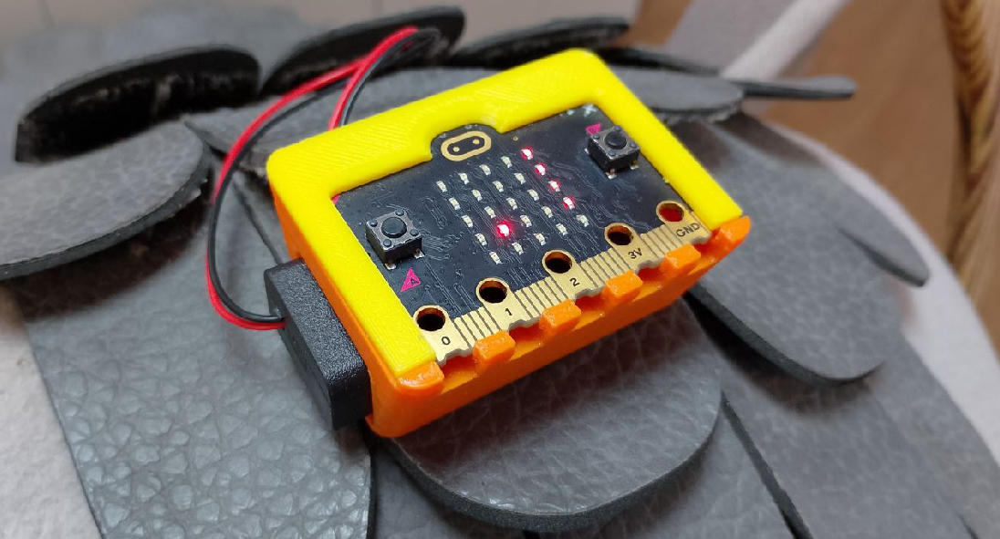
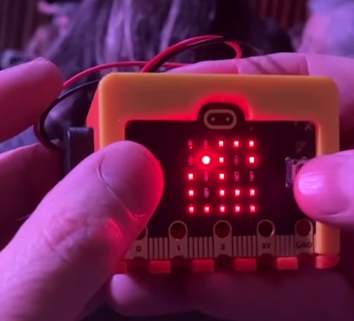

# Snake

por [Tomate Ruso](xxx@gmail), CNBA 2do 13  

# Descripción

Clásico juego de la viborita, o los "lightcycles" de [TRON](https://es.wikipedia.org/wiki/Tron), MULTIJUGADOR.
Si no te divertís con ésto, GAME OVER :)

Escrito en Python para [BBC micro:bit](https://www.microbit.org/) durante el [curso de Robótica](https://www.cnba.uba.ar/novedades/inscripcion-al-curso-de-robotica), por iniciativa de Tomate Ruso. Está actualmente en constante evolución, para incorporar temas de Programación y Electrónica, por lo que se recomienda revisar  seguido éste repo. 

# Instalación

- copiar el código  de main.py y microbitml.py
    - pegarlos en https://python.microbit.org  (con cuidado de crear los archivos correspondientes en el editor
- ahí puede emularse o bajar al hardware de la forma habitual

Notas sobre el hardware:
1. Escrito en Python para [BBC micro:bit v2](https://www.microbit.org/) (usaremos el parlantito, eventualmente), pero debería correr en cualquier versión de Micro:bit.

Notas sobre el software:
1. apuntamos a aprender Python [de verdad](https://microbit-micropython.readthedocs.io), la transpilación desde Makecode(R) no está soportada,  recomendamos https://python.microbit.org
2. la emulación hace tedioso jugar porque es molesto apretar los botones, tema a mejorar?

# Cómo jugar

1. apretá botonitos
2. tratá de pasar el récord actual:

14 puntos!!

# Cómo colaborar

El autor original, Tomate Ruso, decidió publicar su trabajo como Software Libre (FLOSS), los canales de colaboración son los habituales.

# Licencia

[GPL v2](https://www.gnu.org/licenses/old-licenses/gpl-2.0.html)  
(C) Tomate Ruso  
(C) [Robótica - AITEC - CNBA](https://www.cnba.uba.ar/novedades/inscripcion-al-curso-de-robotica)  
(C) 2025 - [Fundación Sadosky](https://fundacionsadosky.org.ar/)
